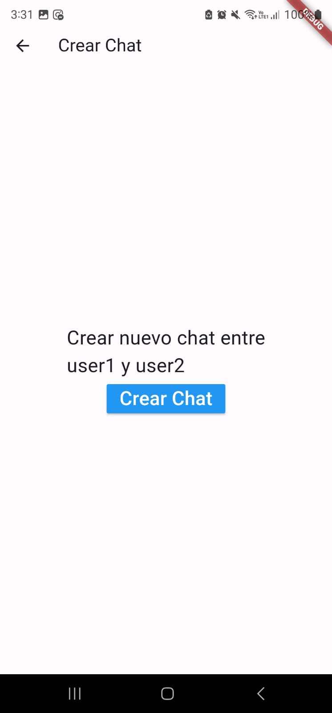
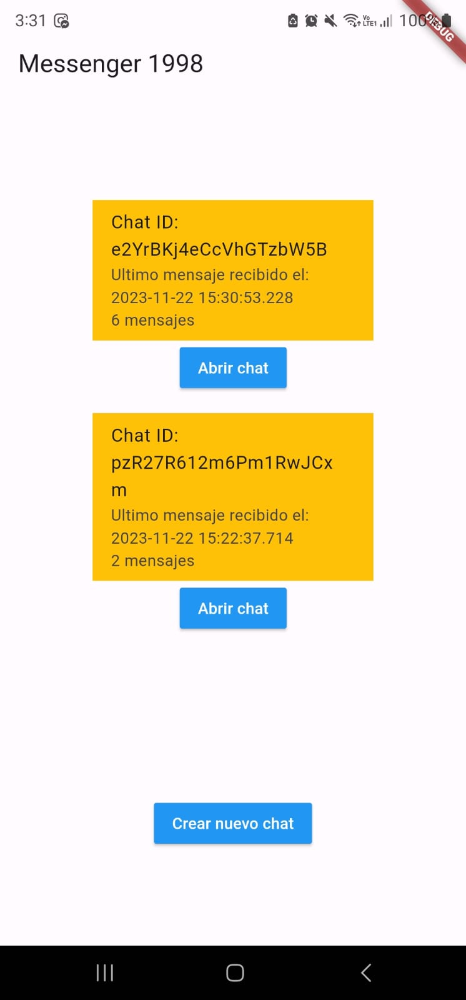
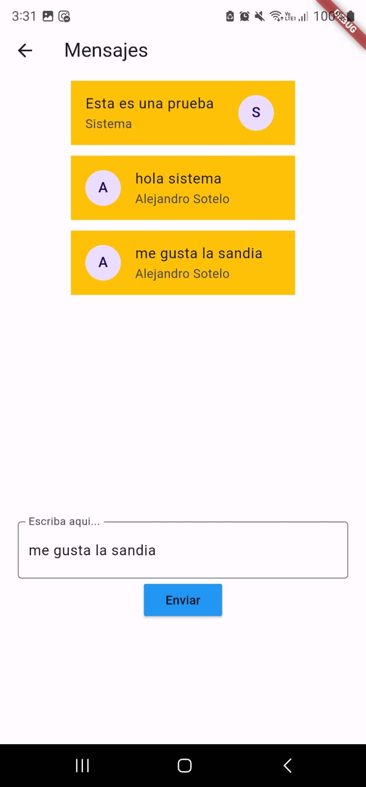

# Chat_Application
- Una aplicacion que usa Firestore Databse para almacenar chats y mensajes.
- Cada chat puede tener varios usuarios y dentro de su coleccion, un numero ilimitado de mensajes.
- Se usan dos Getters: Uno para listar todos los chats del usuario y otro para
- los mensajes de cada uno.
- Ademas, se pueden insertar mensajes en cada chat y crear nuevos chats entre user1 y user2.

## Tecnologias
- Firestore Database
- Firestore UI para los getters

## Lo que me costo mas trabajo
Lo que mas costo fue, como en otras ocasionas, arrancar todos los servicios para trabajar.
Fuera de esto, gracias a las otras clases y a lo que se ha logrado avanzar del proyecto,
manejar las consultas fue mas facil de lo que pense, aunque sin duda fue un reto entender
las colecciones anidadas.

## Lo que aprendi
- Manejo de colecciones anidadas en Firestore Database
- Comprension sobre querys en Firestore

## Screenshots

