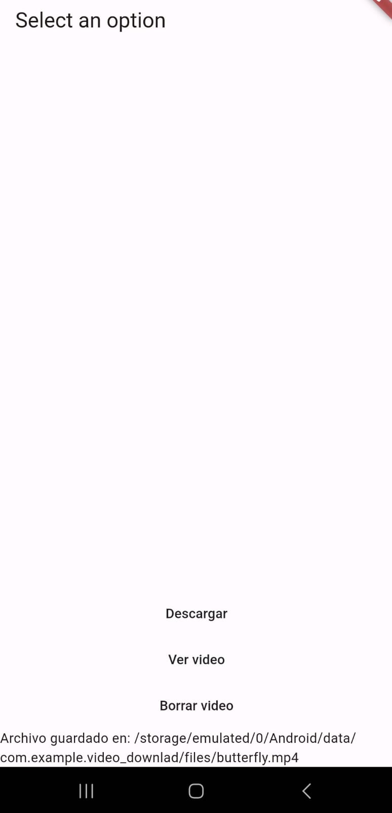
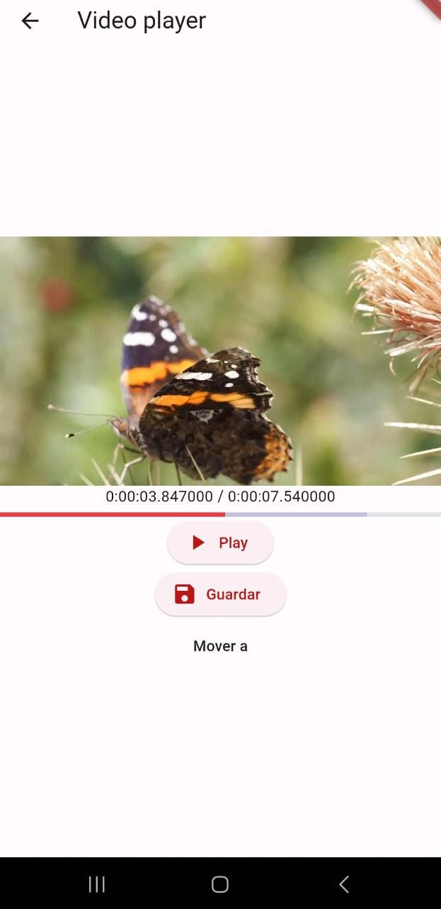

# video_download
- Descarga el video de un URL dado por la aplicación
- permitiendo visualizarlo y guardar el progreso del video
- usando una base de datos.

- Provider
- SQLite usando sqflite
- Uso de path para guardar archivos en l memoria del dispositivo

## Lo que me costo mas trabajo
El trabajo fue sencillo de realizar, siendo lo unico que costo trabajo
fue el manejo de SQLite, pues la documentación no daba mucha explicación
y fue una busqueda extensa para comprender su funcionamiento, pero
una vez hecho esto, fue fácil de codificar.

## Lo que aprendi
- Manejo de archivos locales en android
- Manejo de SQLite como base de datos local

## Screenshots

